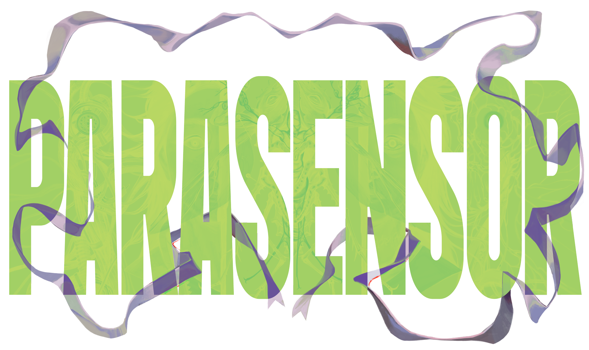

<section id="hero">
	
	<a href="{{site.link.steam}}" target="_blank"><button class="action"><i class="fa-brands fa-steam"></i> Wishlist on Steam</button></a>
</section>

<section id="blurb" class="dark quote">
	
“

	
Parasensor is a story-rich, non-linear horror game with mechanics involving investigation, conversation, and environmental puzzle solving.

	
„

</section>

<section id="trailer" class="dark">
	<h2>Watch our announcement trailer:</h2>
	

		<iframe frameborder="0" allowfullscreen="" allow="accelerometer; autoplay; clipboard-write; encrypted-media; gyroscope; picture-in-picture; web-share" referrerpolicy="strict-origin-when-cross-origin" title="Parasensor - Announce Trailer (WISHLIST NOW!)" width="100%" height="100%" src="https://www.youtube.com/embed/XU68Fm8D6Og?autoplay=0&amp;mute=0&amp;controls=1&amp;loop=0&amp;origin=https%3A%2F%2Fwww.ghoulish.com.au&amp;playsinline=1&amp;enablejsapi=1&amp;"></iframe>
	

</section>

<section class="half">
	<h2>Who are we?</h2>
	
We're a brand spankin' new videogame studio based in Naarm/Melbourne, Australia!
		 
	We reckon we're pretty cool.

</section>

<section class=" dark half">
	
</section>

<section>
	

	{{ site.title }} operates on the unceded lands of the Boon Wurrung and Woiwurrung
	peoples of the Kulin Nation. We acknowledge the Traditional Owners of Country
	throughout Victoria and pay our respects to their Elders, past and present.
	

	
<b>Always was, always will be.</b>

</section>