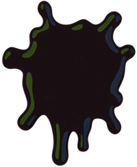

<section id="hero" class="dark">
	
	<a href="{{site.link.steam}}" target="_blank"><button class="action"><i class="fa-brands fa-steam"></i> Wishlist on Steam</button></a>
</section>

<section id="blurb" class="dark quote">
	
“

	
Parasensor is a story-rich, non-linear horror game with mechanics involving investigation, conversation, and environmental puzzle solving.

	
„

</section>

<section id="trailer" class="dark">
	
	
	
	
	
	<h2>Watch our latest trailer:</h2>
	

		<lite-youtube videoid="74yOtFSqHYM" playlabel="Play: Parasensor - Announce Trailer (WISHLIST NOW!)"></lite-youtube>
	

</section>

<section id="who-are-we" class="half bg_3">
	<h2>Who are we?</h2>
	
Ghoulish is a brand spankin' new videogame studio based in Naarm/Melbourne, Australia!

	
We reckon we're pretty cool.

	
Find out more on our <a href="/about/">about page</a>!

	
</section>

<section id="newsletter" class="half bg_4">
	
</section>

<section id="acknowledgement" class="bg_2">
	
Ghoulish operates on the unceded lands of the Boon Wurrung and Woiwurrung peoples of the Kulin Nation. We acknowledge the Traditional Owners of Country throughout Victoria and pay our respects to their Elders, past and present. <b>Always was, always will be.</b>

</section>